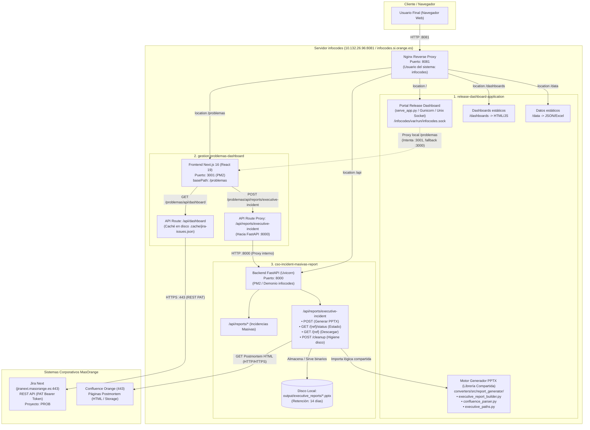
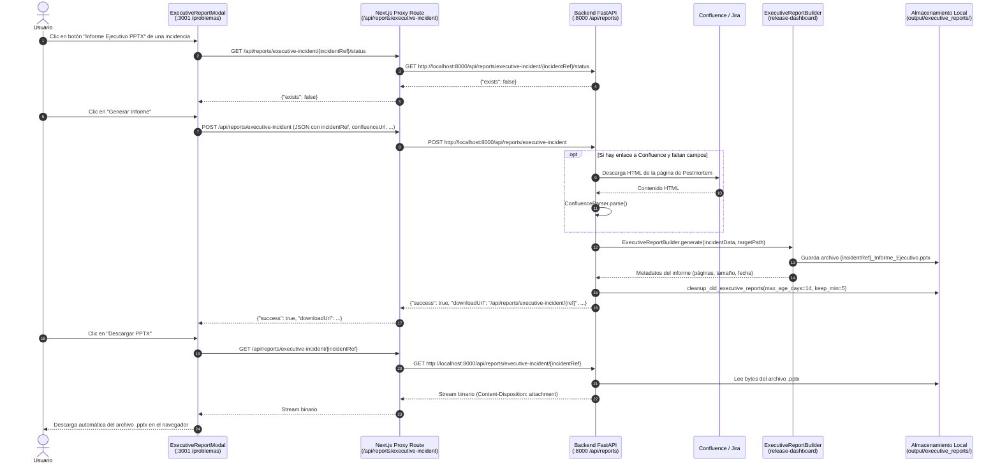
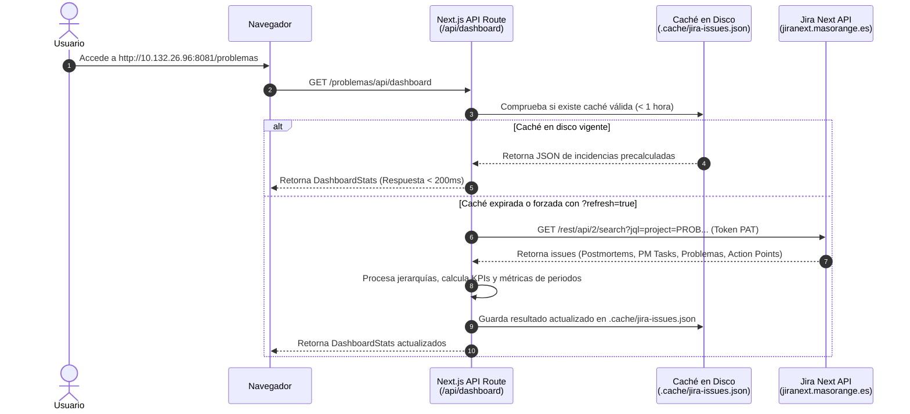

# Arquitectura del Sistema: Gestión de Problemas y Portal de Incidencias

Este documento describe la arquitectura global, topología de red, componentes, APIs y flujos de comunicación entre los tres proyectos interconectados:
1. **`release-dashboard-application`** (Portal Central y Motor de Generación PPTX)
2. **`gestion-problemas-dashboard`** (Dashboard Next.js de Gestión de Problemas)
3. **`cso-incident-masivas-report`** (Backend FastAPI y API REST de Informes)

---

## 1. Diagrama de Arquitectura Global



---

## 2. Matriz de Puertos, Protocolos y Rutas

| Componente / Servicio | Puerto Interno | Puerto Público | Protocolo | Endpoint / Upstream Nginx | Descripción |
| :--- | :--- | :--- | :--- | :--- | :--- |
| **Nginx (Frontend Unificado)** | `8081` | `8081` | HTTP | `http://10.132.26.96:8081` | Punto de entrada unificado para todas las aplicaciones |
| **Portal Release Dashboard** | Unix Socket | `8081` | HTTP (Sock) | `location /` -> `unix:/infocodes/var/run/infocodes.sock` | Portal general de releases y aplicaciones |
| **Dashboard de Problemas** | `3001` | `8081` | HTTP Proxy | `location /problemas` -> `http://localhost:3001` | Next.js App (React 19, Turbopack, Tailwind) |
| **Backend Informes (FastAPI)** | `8000` | `8081` | HTTP Proxy | `location /api` -> `http://localhost:8000` | FastAPI con endpoints REST y generador PPTX |
| **Jira Next (MasOrange)** | `443` | - | HTTPS | `https://jiranext.masorange.es/rest/api/2` | Invocado por Next.js usando Personal Access Token |
| **Confluence (MasOrange)** | `443` | - | HTTPS | URLs de postmortems vinculadas a las incidencias | Invocado por FastAPI para extraer impacto y causas |

---

## 3. Descripción de Componentes

### 3.1. `release-dashboard-application` (Portal y Motor PPTX)
* **Función**: Actúa como aplicación principal del servidor y aloja el motor de construcción de informes PowerPoint.
* **`serve_app.py`**:
  - Servidor de aplicaciones web que atiende peticiones del portal.
  - Implementa un **Proxy Inverso Dual** para la ruta `/problemas`:
    - Intenta conectar al puerto **`3001`** (puerto estándar de producción de Next.js gestionado por PM2).
    - Si no responde, realiza un fallback automático al puerto **`3000`** (puerto habitual en ejecución standalone o desarrollo).
* **Motor Generador de Informes (`converters/src/report_generator/`)**:
  - `confluence_parser.py`: Parsea contenido HTML exportado o descargado de páginas de postmortem en Confluence (título, resumen, impacto de negocio, causa raíz, línea temporal, acciones tomadas). Incluye fallback para extraer datos si solo se dispone de la descripción de Jira.
  - `executive_report_builder.py`: Genera presentaciones PowerPoint (`.pptx`) en formato panorámico 16:9 con paleta visual corporativa Orange (`#F16E00`, `#000000`, etc.), tipografía Helvetica Neue, cajas de métricas destacadas y prevención de solapes de texto mediante cálculo dinámico de cajas envolventes.
  - `executive_paths.py`: Gestiona la ubicación de almacenamiento de informes generados (`output/executive_reports/`) y la función `cleanup_old_executive_reports` para retención e higiene de disco.

---

### 3.2. `gestion-problemas-dashboard` (Dashboard de Gestión de Problemas)
* **Tecnología**: Next.js 16 (App Router, Turbopack, React 19, TypeScript, Chart.js).
* **Configuración de Producción**:
  - Servido bajo el subpath `/problemas` mediante `NEXT_PUBLIC_BASE_PATH=/problemas`.
  - Escucha en el puerto **`3001`**, gestionado como demonio con **PM2** bajo el usuario `infocodes`.
* **Capas del Proyecto**:
  - **Frontend**:
    - **Pestaña General**: Resumen ejecutivo cruzado de Postmortems, PM Tasks, Problemas y Action Points.
    - **Pestañas Especializadas**: Postmortems, PM Tasks de postmortem, Problemas y Action Points.
    - **Gráficos y KPIs**: Backlog acumulado, entradas vs resueltas por día, tiempo medio de resolución y agrupación por estado / grupo asignado.
    - **Modal de Informe Ejecutivo (`ExecutiveReportModal.tsx`)**: Integrado en la tabla de incidencias; permite comprobar estado, solicitar generación al backend FastAPI y descargar directamente el `.pptx`.
  - **API Routes (BFF - Backend for Frontend)**:
    - `GET /api/dashboard`: Obtiene las incidencias del proyecto `PROB` de Jira mediante REST API. Cuenta con un sistema de **doble nivel de caché** (memoria + persistencia en disco en `.cache/jira-issues.json` con TTL configurable) que reduce el tiempo de respuesta de más de 20 segundos a menos de 200 milisegundos.
    - `POST /api/reports/executive-incident` y `GET /api/reports/executive-incident/[...slug]`: Rutas proxy que redirigen las peticiones de informe ejecutivo al backend FastAPI (`BACKEND_REPORTS_URL`, por defecto `http://localhost:8000`).

---

### 3.3. `cso-incident-masivas-report` (Backend FastAPI)
* **Tecnología**: FastAPI + Uvicorn (Python 3.10+).
* **Puerto**: **`8000`** (`BACKEND_PORT=8000`).
* **Endpoints de Informes Ejecutivos**:
  - `POST /api/reports/executive-incident`:
    - Recibe el identificador de incidencia (`incidentRef`), título, enlace a Confluence y datos complementarios.
    - Descarga y analiza la página de Confluence o utiliza la extracción heurística de la descripción de Jira como fallback.
    - Si el informe ya existe en disco y no se fuerza regeneración (`force=false`), devuelve inmediatamente la referencia en caché.
    - Si se genera de nuevo, invoca a `ExecutiveReportBuilder`, almacena el `.pptx` en disco y ejecuta automáticamente la rutina de higiene para eliminar informes con más de 14 días.
  - `GET /api/reports/executive-incident/{incident_ref}/status`:
    - Comprueba si el informe ya está compilado en disco.
  - `GET /api/reports/executive-incident/{incident_ref}`:
    - Retorna el flujo binario del archivo PowerPoint con cabecera `Content-Type: application/vnd.openxmlformats-officedocument.presentationml.presentation` y `Content-Disposition: attachment`.
  - `POST /api/reports/executive-incident/cleanup`:
    - Endpoint manual o programado para purga de informes antiguos con parámetros `max_age_days` (defecto 14) y `keep_min` (defecto 5).

---

## 4. Flujos de Secuencia

### 4.1. Generación y Descarga del Informe Ejecutivo PPTX



---

### 4.2. Carga y Caché de Datos de Jira en el Dashboard



---

## 5. Configuración de Nginx en Producción

El servidor comparte un único puerto de entrada (**`8081`**) mediante Nginx (`/infocodes/nginx/conf/nginx.conf`):

```nginx
# Upstream para FastAPI backend (cso-incident-masivas-report)
upstream fastapi_backend {
    server localhost:8000;
}

# Upstream para Dashboard de Gestión de Problemas (Next.js en PM2)
upstream gestion_problemas_backend {
    server localhost:3001;
}

server {
    listen 8081 default_server;
    server_name 10.132.26.96 infocodes.si.orange.es;

    # Portal Principal
    location / {
        proxy_pass http://unix:/infocodes/var/run/infocodes.sock;
    }

    # Dashboards Estáticos
    location /dashboards {
        alias /infocodes/project/release-dashboard-application/dashboards;
        index index.html;
    }

    # Dashboard de Gestión de Problemas (Next.js)
    location /problemas {
        proxy_pass http://gestion_problemas_backend;
        proxy_set_header Host $host;
        proxy_set_header X-Real-IP $remote_addr;
        proxy_set_header X-Forwarded-For $proxy_add_x_forwarded_for;
        proxy_set_header X-Forwarded-Proto $scheme;
    }

    # API Backend (FastAPI)
    location /api {
        proxy_pass http://fastapi_backend;
        proxy_set_header Host $host;
        proxy_set_header X-Real-IP $remote_addr;
        proxy_set_header X-Forwarded-For $proxy_add_x_forwarded_for;
        proxy_set_header X-Forwarded-Proto $scheme;
        proxy_connect_timeout 60s;
        proxy_read_timeout 60s;
    }
}
```

---

## 6. Variables de Entorno Clave

### `gestion-problemas-dashboard` (`.env.local` / `.env.production.local`)
| Variable | Valor Típico | Propósito |
| :--- | :--- | :--- |
| `NEXT_PUBLIC_BASE_PATH` | `/problemas` | Prefijo de ruta web para servir detrás de Nginx |
| `NEXT_PUBLIC_JIRA_DOMAIN` | `jiranext.masorange.es` | Dominio de la instancia de Jira de MasOrange |
| `JIRA_API_TOKEN` | *`<PAT_TOKEN>`* | Token de Acceso Personal para autenticación con Jira |
| `NEXT_PUBLIC_JIRA_PROJECT_KEY`| `PROB` | Código del proyecto de problemas en Jira |
| `BACKEND_REPORTS_URL` | `http://localhost:8000` | URL interna del backend FastAPI para generar PPTX |

### `cso-incident-masivas-report` (`backend/.env`)
| Variable | Valor Típico | Propósito |
| :--- | :--- | :--- |
| `PORT` / `BACKEND_PORT` | `8000` | Puerto en el que escucha Uvicorn / FastAPI |
| `RELOAD` | `false` | Desactivar reload automático en producción |

### `release-dashboard-application` (`.env`)
| Variable | Valor Típico | Propósito |
| :--- | :--- | :--- |
| `NEXTJS_PROBLEMAS_URL` | `http://localhost:3001` | URL objetivo a la que `serve_app.py` redirige `/problemas` |

---

## 7. Gestión de Procesos y Persistencia en Producción

Dado que el servidor opera bajo el usuario de sistema `infocodes` sin permisos de `root` ni `systemd`:
1. **Next.js** se gestiona mediante **PM2 en modo usuario**:
   ```bash
   npx pm2 start ecosystem.config.js
   npx pm2 save
   ```
2. **Persistencia tras reinicio de la máquina**: Se configura una entrada en el `crontab` del usuario `infocodes`:
   ```bash
   @reboot cd /infocodes/project/gestion-problemas-dashboard && PATH=/infocodes/nodejs/bin:$PATH npx pm2 resurrect
   ```
3. **Backend FastAPI**: Se arranca mediante PM2 o script de arranque en segundo plano (`nohup python3 -m uvicorn main:app --host 0.0.0.0 --port 8000 &`).

